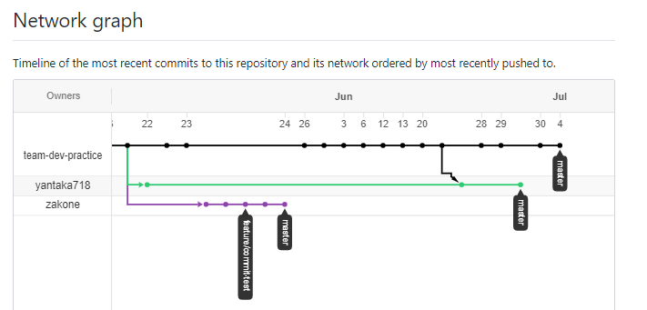
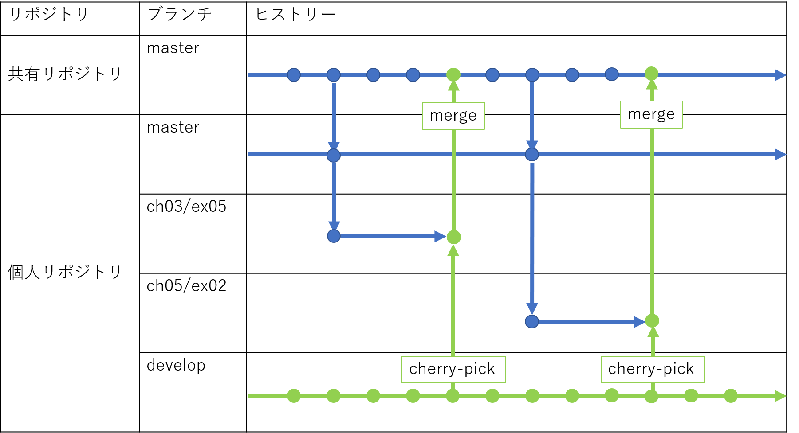

# Python勉強会キックオフ

---

# 使用する本

<center></center>

---

# 勉強会の進め方（ほぼ決定事項）

- ２～３週間に１回のペースで２時間ほどの時間を確保
- あらかじめ決めた範囲の予習を各自実施
- 各章ごとに演習問題があるため、すべて解いておく
- 期限までにGitHubに回答の実装をpushしておく
- 輪講を実施

勉強会で実施する内容について検討中のこともあるため今日決めたい

---

# 勉強会の進め方

- 事前に演習問題の担当者を決めておく。
- 担当者は期限までに実装を完了させ、プルリクエストを発行
- 担当者以外で時間がある人はコードレビューを実施
- 当日、実装者からレビューに対応案を回答してもらい、後日修正後マージ

＜メリット＞  
一人当たりの負担が小さい
最終的に１つのmaster branchにすべての回答が集約されるため復習もしやすい

＜デメリット＞  
レビュアーが偏りそう

---

# Githubでの運用

https://github.com/python-practice-for-dsd

- メインのリポジトリを決めておき、そこから各自Forkして各々作業する
<center></center>

- 同一リポジトリで各自ブランチ切ることも考えたが、historyがごちゃごちゃしそうだなと妄想
- とはいえ、自分の実装を公開したくない人もいるかもなので、ここは検討

---

# Github運用補足

フォルダ構成案

```
DSD/
　├ ch0/
　│　├ ex1/
　│　├ ex2/
　│　└ document.md
　├ ch1/
　│　├ ex1/
　│　├ ex2/
　│　├ ex3/
　│　└ document.md
　├ ch2/
　│　├ ex1/
```
---

# Github運用補足2

自分の実装と他の人の実装を共存させる方法例



---

# スケジュールをきめよう

1章：19 page, ex 5
2章：30 page, ex 6
3章：34 page, ex 18
4章：47 page, ex 12
5章：16 page, ex 7
6章：26 page, ex 10
7章：34 page, ex 14
8章：55 page, ex 12
9章：32 page, ex 5
10章：24 page, ex 9
11章：54 page, ex 5
12章：42 page, exなし

---
